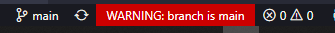

# Git Flow

Explicação de como é o Git Flow e a utilização das *branches* 

## Introdução:

O Git Flow é uma estratégia criada para melhorar as organizações das Branchs (ramificações) dentro do repositório e, desta forma, dar mais fluidez ao processo de novas Features e Releases.

**Não confunda Git Flow com Git**

O Git Flow trouxe uma solução mais robusta, justamente para aqueles projetos que vão ganhando corpo ou que precisam sofrer novas atualizações constantemente. Ou ainda, também, quando existe uma grande quantidade de pessoas “commitando” dentro de um repositório.

### Existem 2 categorias de Branch:

- **Principais**: Master outra chamada Develop.
- **Suporte**: Feature, Release e HotFix.

**Master**: É a partir dela que é criada a branch develop e é utilizada para enviar os releases para a Produção, que contará com todas as Features **estáveis** que passarão pelo processo Merge posteriormente para uma Branch de Release.

**Feature**: Para cada nova feature é criada uma ramificação a partir da branch develop, uma boa prática é criar uma branch com nome ***feature/***,* assim fica mais fácil de identificá-las. Após a feature ser concluída, ela voltará via Merge para a branch develop e a branch da feature deverá ser **removida**.

**Develop**: É uma ramificação onde tem todas os recursos que ja estão na branch master, e é de onde se estendem as features branches. Pode ser utilizada para testar as novas funcionalidades que ainda não foram para a master (Ja que a feature branch só deve ser mergeada após a conclusão da feature)

**Release**: Após ter um conjunto de novas features prontos, elas devem ser unidas em uma Branch release e ai sim fazer o merge para a branch master (uma release também pode ser feita com apenas uma feature). Importante que logo após ter sido feito o merge do release, é importante criar a tag de release no Git, ou seja, uma indicação, onde conterá uma nova versão do seu projeto. **Isso é feito na Branch Master.** 

Em cada Merge realizada na Master, **é preciso fazê-la também na Branch Develop**, para refletir em um novo Release tageado e, aí sim a Branch desse Release poderá ser removida.

**Hotfix**: Ela funciona como uma Branch Release, com a diferença de que, nesse caso, é utilizada para uma ação mais crítica. Por isso, quando uma Hotfix é finalizada, ela vai ser “Mergeada” diretamente na Master. Ela também recebe uma tag na Master após esse processo e deve ser feito o mesmo na Branch Develop. O nome da branch de HotFix é **hotfix/***

Desta forma, é possível manter os desenvolvedores trabalhando em suas Features, enquanto as Hotfix são criadas.

Aí sim as Branches com Hotfix podem ser removidas.

## Extensões e configurações:

*First of all*, aconselho baixarem a extenção “[*Git Branch Warnings*](https://marketplace.visualstudio.com/items?itemName=teledemic.branch-warnings)”, ela irá te avisar quando você estiver na branch “master”, “main”, etc. Para evitar que você faça publicações na branch errada



(Você pode configurar para quais branches ela deve te avisar)

Para facilitar a visualização (porém é opcional), você pode baixar a extensão “[Git Graph](https://marketplace.visualstudio.com/items?itemName=mhutchie.git-graph)”, e ver um gráfico ilustrado sobre as ramificações do repositório Git


Após feito o download e Instalação, vamos realizar a configuração do seu VS Code:


Minha sugestão de configuração é essa aqui:

```jsx
{
    "branchwarnings.protectedBranches": [ "main", "master", "develop", "release/**" ],
    "git.confirmSync": false,
    "git.autofetch": true,
    "git.pruneOnFetch": true,
    "git.fetchOnPull": true
}
```

- branchwarnings.protectedBranches = Array com nome das branches que irá aparecer o aviso no rodapé
- git.confirmSync = Falso para não precisar confirmar nada pro git fazer sincronizações
- git.autofetch = Git irá realizar buscas automáticas de atualizações no Repositório
- git.pruneOnFetch = “podar na busca”, irá remover branches remotas que foram excluídas no Git, mas por alguma razão ainda aparecem para você no VS Code
- git.fetchOnPull = Buscar atualizações na hora de enviar commits para o Repo

## Como utilizar:

Branches são ramificações dos códigos e uma branch existe em 2 lugares, remotamente (No seu versionador, neste caso o GitHub) e localmente
Isso será importante para entender alguns conceitos futuramente

Após você ja ter a branch master e develop

Para nosso exemplo, vou partir do ponto que ja temos um código com alguns métodos implementados:

```jsx
function main (){
    console.log("Gato Felix!")
}

function andar (){
    console.log("Gato está andando")
}

function comer (){
    console.log("Gato está comendo")
}

main()
```

Você vai estar na branch develop e criar uma nova branch:


Após apertar Enter, automaticamente nós vamos ser direcionados para a branch que criamos:


Na aba do Git, publique a branch:


Após implementar a nova funcionalidade:

```jsx
function main (){
    console.log("Gato Felix!")
}

function andar (){
    console.log("Gato está andando")
}

function comer (){
    console.log("Gato está comendo")
}

function beber (){
    console.log("Gato está bebendo")
}

main()
```

Vamos commitar e fazer o Sync normalmente.

Feito isso, você deve trocar de branch, para a branch develop (pois ela deve receber o novo método)


E fazer o Merge para a branch develop


Escolha de qual branch você está trazendo a feature:


E em seguida é só sincronizar:


Após isso, vamos deletar a branch LOCAL da feature:


Para deletar a branch REMOTA, não encontrei uma forma de fazer isso via botão pelo VS Code, mas existe o comando via terminal

```powershell
git push [nome-do-remote] :[nome-da-branch]
```

Você pode descobrir o nome do seu remote, tentando excluir (mas NÃO EXCLUINDO no VS Code):


No meu caso, é origin:


Então o comando seria este:

```powershell
git push origin :feature/fazer-gato-beber
```

Feito pelo próprio terminal do VS Code:


Os mesmos conceitos se aplicam para o HotFix, Release, etc